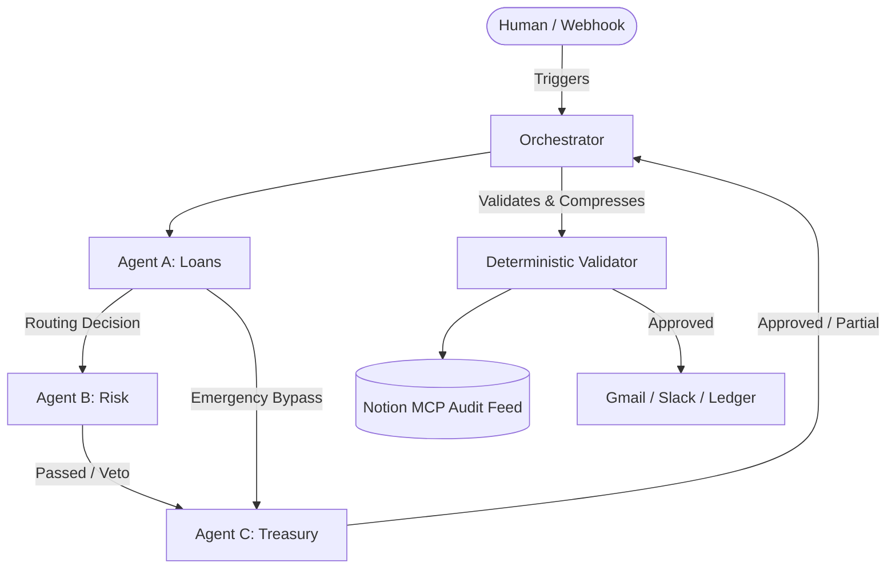

# GovMemory

**An AI-native operating system for a simulated bank, where Loans, Risk & Compliance, and Treasury are AI agents that negotiate decisions, cite policy clauses, and still stop for a human when it matters.**

> **DISCLAIMER:** This is a SIMULATION for a hackathon — no real financial, credit bureau, or customer data is used anywhere.

## 2. The Problem
Bank departments operate in silos, negotiate over email, and have no live record of why decisions were made. Approvals are slow, context is lost across Slack channels and inboxes, and retroactive auditing requires manually piecing together fragmented human conversations to understand the true rationale behind a financial decision.

## 3. What This Project Does
- **Multi-Agent Negotiation Loop:** Routes applications through Loan (A), Risk (B), and Treasury (C) agents that iteratively negotiate terms (e.g. splitting disbursements if funds are low) up to a hard round cap, before reverting to a human.
- **Multi-Key LLM Failover:** Implements an `LLMKeyPool` (`app/agents/llm_client.py`) that seamlessly rotates through API keys upon hitting 429 rate limits, preventing infrastructure-level hallucination or crashes.
- **Deterministic Validation:** A pure-code Validator (`app/orchestrator/validator.py`) statically parses the Policy Book and strictly enforces that agents cite real clauses, immediately stopping any rogue autonomous approvals over thresholds.
- **Organizational Memory via Notion:** Uses the Model Context Protocol (MCP) to sync the real-time state of the bank to Notion, pushing automated executive summaries of LLM transcripts directly into a Manager Audit Feed.
- **Secure Integration Sandbox:** Includes idempotency guards and mock services (`mock_services.py`, `USE_MOCK_GMAIL`, `USE_MOCK_SLACK`) that route downstream executions securely away from production channels during development.

## 4. Architecture



**The Negotiation Loop:** The `NegotiationEngine` runs a maximum of 4 rounds of negotiation. If Agent C (Treasury) can only provide a `PARTIAL` disbursement, the state machine feeds the counter-proposal back into the loop. If consensus is not reached before the round cap is exhausted, the engine safely escalates the transaction to the Manager Approval Desk as a `REJECTED` proposal requiring human review, rather than throwing an unhandled exception.

**The Deterministic Validator:** LLMs are non-deterministic, so our safety bounds are not. The validator (`app/orchestrator/validator.py`) parses `policy_book.md` directly. It strictly verifies that every agent's cited clause actually exists in the text. Furthermore, it enforces a hard ₹50,000 autonomous execution threshold—if an agent attempts to approve >₹50,000 without explicitly flagging `requires_human_review`, the transaction is blocked and forced to the Manager Desk.

**State Split (Runtime vs Durable Memory):** The system splits state intentionally. Runtime negotiation state, concurrency locks, and idempotency tracking are held in-memory via `app/services/transaction_store.py` (which would be Redis/SQLite in production). Long-term organizational memory, policy records, and executive summaries are pushed to Notion. This ensures the bank's "memory" is readable and auditable by non-engineers natively in their workspace.

## 5. Tech Stack
- **Backend Framework:** FastAPI, Uvicorn
- **AI / Agents:** Gemini 2.0 Flash (via `google-genai` / HTTPX direct integration), Tenacity (retries)
- **Persistence:** In-Memory `TransactionStore` (Runtime) / Notion API (Durable)
- **External Integrations:** Notion MCP (`@modelcontextprotocol/server-notion`), Slack Webhooks, Gmail SMTP/OAuth
- **Testing & Tooling:** Pytest, Pytest-Asyncio, Structlog, Ruff, Mypy

## 6. Repository Structure

```text
.
├── app/
│   ├── agents/          # AI agents (Loans, Risk, Treasury), LLM Key Pool, Policy Book
│   ├── integrations/    # External connectors (Notion MCP, Slack, Gmail, Mock Services)
│   ├── models/          # Pydantic schemas (Transaction, Proposal, Policy)
│   ├── orchestrator/    # Core logic (Negotiation Engine, State Machine, Validator, History)
│   ├── routes/          # FastAPI endpoints (Webhooks, Orchestration, Health, Simulate)
│   ├── scripts/         # CLI tools (Simulate Trigger, Fixture Persistence)
│   └── services/        # Background workers (Notion Poller, Transaction Store, Audit Feed)
├── brain/               # Agent logs, IDE state, and temporary artifacts
├── tests/               # 119-test suite (Unit, Integration, E2E Scenarios, Live Smoke)
├── pyproject.toml       # Python dependencies and tool configs
├── mcp.json             # Notion MCP server configuration
└── .env.example         # Template for environment variables
```

## 7. Setup & Installation

Follow these steps to run the simulation on a clean machine:

1. **Clone & Setup Python:** Ensure you have Python 3.11+ installed.
   ```bash
   git clone https://github.com/07nishkarsh/Omni.git
   cd Omni
   python -m venv .venv
   source .venv/bin/activate
   ```

2. **Install Dependencies:**
   ```bash
   pip install -e ".[dev]"
   ```

3. **Configure Environment:**
   Copy `.env.example` to `.env` and fill in the required variables:
   ```bash
   cp .env.example .env
   ```
   *Required Variables in `.env`:*
   - `GEMINI_API_KEYS` (comma-separated list of Gemini API keys)
   - `NOTION_TOKEN`
   - `NOTION_PARENT_PAGE_ID` (for workspace setup)
   - `GMAIL_CLIENT_ID`, `GMAIL_CLIENT_SECRET`, `GMAIL_REFRESH_TOKEN`, `GMAIL_SENDER_ADDRESS`, `GMAIL_SANDBOX_TO`
   - `SLACK_WEBHOOK_URL`, `SLACK_BOT_TOKEN`, `SLACK_CHANNEL_ID`, `SLACK_SANDBOX_CHANNEL`

4. **Initialize Notion Workspace:**
   Run the Notion setup script to automatically create the required databases (Approval Desk, Treasury Ledger, Audit Feed).
   ```bash
   python -m app.integrations.notion_setup
   ```
   Copy the outputted Database IDs back into your `.env` file (`NOTION_POLICY_BOOK_ID`, `NOTION_APPROVAL_DESK_ID`, `NOTION_TREASURY_LEDGER_ID`, `NOTION_AUDIT_FEED_ID`).

5. **Start the Backend Server:**
   The database in this simulation is purely in-memory (`TransactionStore`), so no DB migration script is required; state initializes on boot.
   ```bash
   uvicorn app:app --host 0.0.0.0 --port 8000 --reload
   ```

## 8. Running the Demo

You can run full end-to-end triggers directly from the CLI without needing an external API client.

1. **Trigger a Scenario:**
   ```bash
   # Standard Subsidy Loan
   python -m app.scripts.simulate_trigger --type subsidy_loan --applicant APP-001
   
   # Emergency Payout (Hits frozen fund, escalates to Manager Desk)
   python -m app.scripts.simulate_trigger --type emergency_payout --applicant APP-005
   ```
2. **Watch it Happen:** The CLI will immediately print a `TransactionID`. Switch to your Notion Dashboard and watch the "Live Bureaucracy Thread" and "Manager's Executive Desk" databases update as the agents negotiate.
3. **Approve/Reject:** If a transaction hits a snag (like the frozen fund) and escalates, go into the Notion Manager Approval Desk database, find the card, and manually change the Status property to `Approved` or `Rejected`. The background `NotionPoller` will catch the change, resume the transaction, and trigger downstream mock Slack/Gmail executions.

## 9. Running Tests

The test suite validates agent routing, round caps, validations, and the orchestrator using heavily mocked sequences. **The default test suite makes absolutely zero real external network calls to Gemini, Slack, Gmail, or Notion.**

```bash
# Run the full test suite (119 tests)
pytest -v
```

**Live Smoke Testing:**
If you want to verify that your actual `GEMINI_API_KEYS` are working and network connectivity is healthy, run the live smoke test. 
*Warning: This consumes real Gemini API quota.*
```bash
pytest tests/test_live_smoke.py -m live_api -v
```

## 10. Policy Book
The rules of the bank are defined in plaintext Markdown at `app/agents/policy_book.md` (and synced to Notion). The AI Agents read this book as part of their prompt. When they make a decision, they must explicitly cite a clause (e.g., `"Section I, Clause 2"`). The deterministic Validator then independently parses the Policy Book to verify that the LLM didn't hallucinate a non-existent rule.

## 11. Guardrails & Safety Design
This system relies heavily on deterministic guardrails so the LLM is never given unchecked financial authority:
- **Autonomy Threshold:** Hardcoded ₹50,000 threshold. Any proposal above this amount without a `requires_human_review` flag triggers a `ValidationError`.
- **Frozen-Fund Override:** If Agent C touches a fund marked as "Frozen" in the ledger, the code short-circuits the LLM entirely and forces an escalation to a human.
- **Bounded Negotiation:** The `NegotiationEngine` stops looping after 4 rounds (configurable). If no consensus is reached, it yields to a human instead of looping forever.
- **Least-Privilege Notion Writes:** The `NotionAuditClient` acts in append-only mode when pushing summaries to the Audit Feed, ensuring agents cannot rewrite history.

## 12. Known Limitations
- **Mocked Financial Systems:** The Credit Bureau (CIBIL), Tax Registry, and GPS tracking are simulated via hardcoded Python dictionaries (`app/integrations/mock_services.py`).
- **Single LLM Provider:** The `LLMKeyPool` rotates through multiple API keys to avoid rate limits, but is currently hardcoded to use Gemini (Google) models exclusively. 
- **Notion Rate Limits:** The system writes heavily to Notion. Free-tier Notion API rate limits apply; under heavy concurrent load, the MCP server might throttle requests.

## 13. Team
- **Team Name:** [Team Name]
- **Team ID:** [Team ID]
- **College Name:** [College Name]
- **Contributors:** 
  - [Contributor 1]
  - [Contributor 2]
